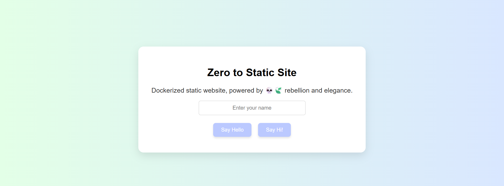
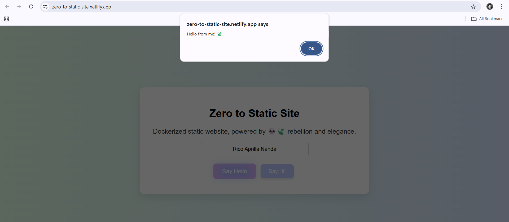

# 💀🍃 zero-to-static-site

<p align="center">
  
  <br/>
  
</p>

From Zero to Static — A minimalist, blazing-fast site crafted with integrity, elegance, and a hint of rebellion. Built to defy noise, speak clarity, and remain timeless in an ever-shifting web.

---

## Features

- Clean folder structure
- Responsive layout with minimal styling
- Blazing fast load time (no framework overhead)
- Instant deployment via Netlify or GitHub Pages
- Easy customization with pure HTML/CSS/JS

---

## Folder Structure

```
zero-to-static-site/
├── assets/ # Images and preview files
├── index.html # Main entry point
├── style.css # Basic styling
└── script.js # Optional JavaScript (empty starter)
```

---


## 🐢 Live Demo

> [🔗 Click here to view the live site](https://your-netlify-url.netlify.app)  
> *(Replace with your actual Netlify link)*

## Getting Started

To clone this repo and start customizing:

```bash
git clone https://github.com/your-username/zero-to-static-site.git
cd zero-to-static-site
```
Then open index.html in your browser or editor.

---

## Deployment

- You can instantly deploy this site using:
- Netlify: Just drag-and-drop your folder.
- GitHub Pages: Push to main, then enable Pages in repo settings.

---

🍃🐢 Author Rico Aprilla Nanda


